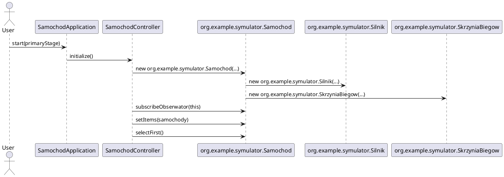
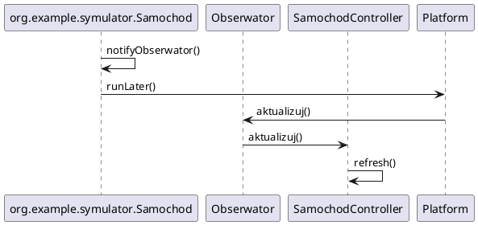
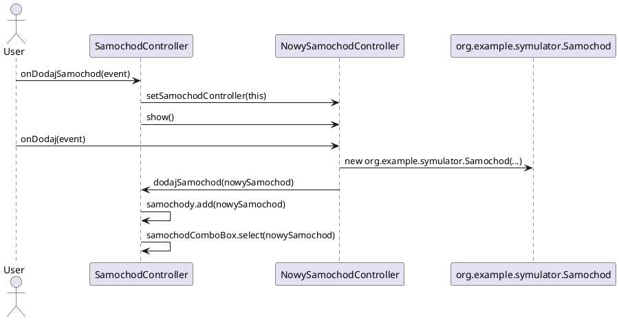

# po2025
Repozytorium dla przedmiotu Programowanie Obiektowe.


Projekt laboratoryjny org.example.symulator.Samochod (symulacja) - GUI
===============================================

Diagramy UML
------------

### Diagram klas

```plantuml
@startuml

package org.example.symulator.Samochod {
    class org.example.symulator.Samochod {
        - String nazwa
        - String nrRejestracyjny
        - org.example.symulator.Silnik silnik
        - org.example.symulator.SkrzyniaBiegow skrzyniaBiegow
        - org.example.symulator.Pozycja org.example.symulator.Pozycja
        - boolean running
        + void wlacz()
        + void wylacz()
        + double getWaga()
        + String getNrRejestracyjny()
        + double getPredkosc()
        + org.example.symulator.SkrzyniaBiegow getSkrzyniaBiegow()
        + org.example.symulator.Pozycja getPozycja()
        + String getNazwa()
        + void notifyObserwator()
    }

    class org.example.symulator.Silnik {
        - int moc
        - int obroty
        + void wlacz()
        + void wylacz()
        + int getObroty()
    }

    class org.example.symulator.SkrzyniaBiegow {
        - int bieg
        + void zwiekszBieg()
        + void zmniejszBieg()
        + int getBieg()
    }

    class org.example.symulator.Pozycja {
        - double x
        - double y
    }
    
    class org.example.symulator.Komponent {
        
    }
    
    class org.example.symulator.Sprzeglo {
        
    }

    interface Obserwator {
        + void aktualizuj()
    }
    
    class SamochodException {
       
    }
}

package samochodgui {
    class SamochodApplication {
        - Stage primaryStage
        - SamochodController samochodController
        + void start(Stage primaryStage)
    }

    class SamochodController {
        - ComboBox<org.example.symulator.Samochod> samochodComboBox
        - ObservableList<org.example.symulator.Samochod> samochody
        - org.example.symulator.Samochod org.example.symulator.Samochod
        - TextField wagaTextField
        - TextField nrRejestracyjnyTextField
        - TextField predkoscTextField
        - TextField nazwaTextField
        - TextField biegTextField
        - Button wlaczButton
        - ImageView carImageView
        - HBox mapa
        - Label welcomeText
        + void initialize()
        + void onDodajSamochod(ActionEvent event)
        + void onUsunSamochod(ActionEvent event)
        + void dodajSamochod(org.example.symulator.Samochod nowySamochod)
        + void refresh()
        + void onWlacz(ActionEvent actionEvent)
        + void onWylacz(ActionEvent actionEvent)
        + void onZmniejszBieg(ActionEvent actionEvent)
        + void onUjmijGazu(ActionEvent actionEvent)
        + void onZwiekszBieg(ActionEvent actionEvent)
        + void onNacisnijSprzeglo(ActionEvent actionEvent)
        + void onZwolnij(ActionEvent actionEvent)
        + void aktualizuj()
    }

    class NowySamochodController {
        - TextField nazwaTextField
        - TextField nrRejestracyjnyTextField
        - TextField mocSilnikaTextField
        - TextField obrotySilnikaTextField
        - TextField biegiSkrzyniTextField
        - SamochodController samochodController
        + void setSamochodController(SamochodController samochodController)
        + void onDodaj(ActionEvent event)
        + void onAnuluj(ActionEvent event)
    }
}

org.example.symulator.Samochod.org.example.symulator.Samochod --> org.example.symulator.Samochod.org.example.symulator.Silnik
org.example.symulator.Samochod.org.example.symulator.Samochod --> org.example.symulator.Samochod.org.example.symulator.SkrzyniaBiegow
org.example.symulator.Samochod.org.example.symulator.Samochod --> org.example.symulator.Samochod.org.example.symulator.Pozycja
org.example.symulator.Samochod.org.example.symulator.Samochod --|> Thread
org.example.symulator.Samochod.org.example.symulator.Samochod *-- org.example.symulator.Samochod.Obserwator
org.example.symulator.Samochod.org.example.symulator.Silnik --|> org.example.symulator.Samochod.org.example.symulator.Komponent
org.example.symulator.Samochod.org.example.symulator.SkrzyniaBiegow --|> org.example.symulator.Samochod.org.example.symulator.Komponent
org.example.symulator.Samochod.org.example.symulator.SkrzyniaBiegow --> org.example.symulator.Samochod.org.example.symulator.Sprzeglo
org.example.symulator.Samochod.org.example.symulator.Sprzeglo --|> org.example.symulator.Samochod.org.example.symulator.Komponent


samochodgui.SamochodController -> org.example.symulator.Samochod.org.example.symulator.Samochod
samochodgui.SamochodController ..|> org.example.symulator.Samochod.Obserwator

samochodgui.SamochodController <-- samochodgui.NowySamochodController
samochodgui.SamochodApplication --> samochodgui.SamochodController

org.example.symulator.Samochod.SamochodException --|> Exception
org.example.symulator.Samochod.org.example.symulator.SkrzyniaBiegow -- org.example.symulator.Samochod.SamochodException

hide methods
hide members
@enduml
```

### Diagram sekwencji



### Diagram sekwencji aktualizacji



### Diagram sekwencji dodania samochodu



### Diagram sekwencji usuwania samochodu

```plantuml
@startuml
actor User
participant SamochodController

User -> SamochodController: onUsunSamochod(event)
SamochodController -> SamochodController: samochody.remove(org.example.symulator.Samochod)
SamochodController -> SamochodController: samochodComboBox.selectFirst()
@enduml
